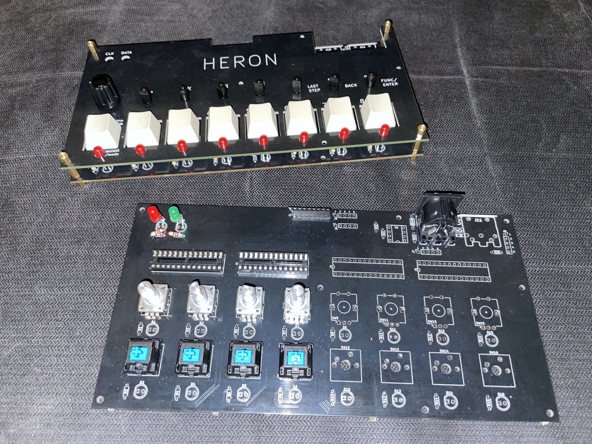
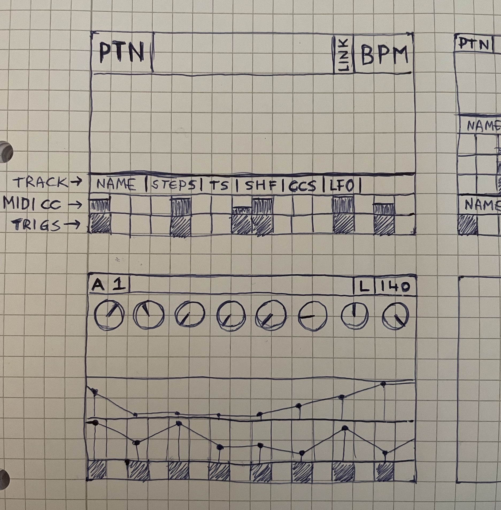
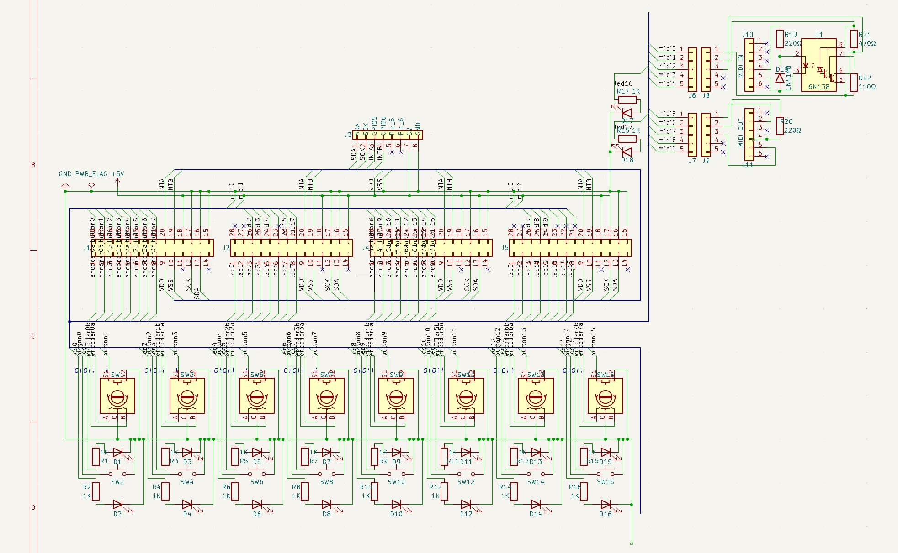
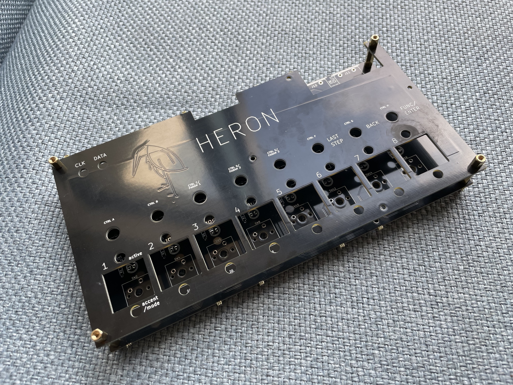

# pi-sequencer

> _Messy weekend project!_

Repository for the "Heron" hardware MIDI sequencer (work in progress) - 2023  

Built with:
- Raspberry Pi 4B
- 4.3" DSI Touch Display
- Midiface 4x4 USB MIDI interface
- Custom PCB and various switches/encoders/GPIO expanders/LEDs/...
- Shell, Python and Node.js

The UI is built with Electron and React. The previous version of the UI used node-raylib - which has less overhead and is more performant, but developing in a browser window is much faster. The quad-core RPi seems to be able to handle it without too much latency. The Electron app communicates with the Python processes for IO access and shared state is stored in memory using Redis.

### Architecture
- External inputs such as buttons/encoders/LEDs are connected to MCP23017 GPIO expanders that connect to the RPi using I2C
- A Python process reads/writes values from/to the GPIO pins and updates the current application state and handles interrupts
- The application state lives in memory using Redis, disk persistence is enabled to reload state after RPi reboot
- The GUI is rendered with Electron and React
- Both the Python and Node.js processes can read/update the application state in Redis
- MIDI commands are sent, received and processed with the `isobar` Python library

#### Requirements
```sh
sudo apt-get install redis -y
sudo pip3 install -r requirements.txt
cd electron && npm install
```

### Footage






