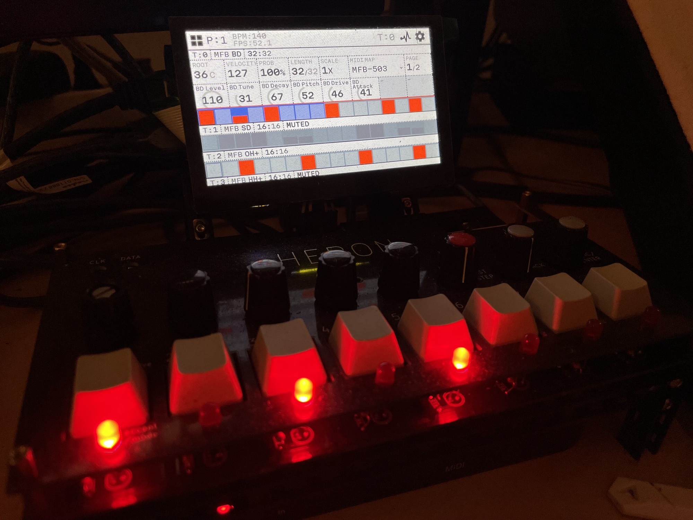

# Multitrack Raspberry Pi hardware MIDI sequencer

> _Messy WIP weekend project_ - 2023

### Intro

> - [Architecture](#architecture)
> - [Installation](#installation)
> - [Usage](#usage)
> - [Development](#development)
> - [Media](#media)
> - [Features / todo's](#features--todos)

Built with:
- Raspberry Pi 4B
- 4.3" DSI Touch Display
- Midiface 4x4 USB MIDI interface
- Custom PCB and various switches/encoders/GPIO expanders/LEDs/...
- Shell, Python and Node.js

The UI is built with Electron and React. The previous version of the UI used [`node-raylib`](https://github.com/RobLoach/node-raylib) - which has less overhead and is more performant, but developing in a browser window is much faster. The quad-core RPi seems to be able to handle it without too much latency. The Electron app communicates with the Python processes for IO access and shared state is stored in memory using Redis.

### Architecture
- External inputs such as buttons/encoders/LEDs are connected to MCP23017 GPIO expanders that connect to the RPi using I2C
- A Python process reads/writes values from/to the GPIO pins and updates the current application state and handles interrupts
- The application state lives in memory using Redis, disk persistence is enabled to reload state after RPi reboot
- The GUI is rendered with Electron and React
- Both the Python and Node.js processes can read/update the application state in Redis
- MIDI commands are sent, received and processed with the `isobar` Python library

### Installation
Tested on Raspberry Pi OS Lite (64-bit)  
```sh
# requirements
sudo apt-get update -y && sudo apt-get install git zsh -y
chsh -s $(which zsh)

# optionally configure git and SSH
git config --global user.email "your@email.com"
git config --global user.name "Your Name"
ssh-keygen -f ~/.ssh/id_rsa -t rsa -N '' -C "your@email.com"

# clone repository
git clone git@github.com:woudsma/pi-sequencer.git pi-sequencer-io

# setup Node.js v18, pip3, startup service, x11, chromium, etc.
cd pi-sequencer-io && ./setup.sh

# installation
sudo pip3 install -r requirements.txt
cd electron && npm install

# to start automatically on boot, add entry for launcher script in ~/.zshrc (or ~/.bashrc)
echo /home/pi/pi-sequencer-io/launcher.sh >> ~/.zshrc
sudo reboot now
```

### Usage  
The MIDI in/out ports will probably need to be updated to the correct ports for your setup. This can be done by updating the `_interface.yml` MIDI chart in `electron/static/midi-charts/`. You just need to make sure to update the `clock_in`, `outs` and `ports.in` + `ports.out` to the available (and desired) ports of your interface. You can find the available input/output ports using:
```sh
sudo python3 -c "import isobar; print(isobar.io.midi.get_midi_input_names())"
# > ['Midi Through:Midi Through Port-0 14:0', 'USB Midi 4i4o:USB Midi 4i4o MIDI 1 20:0', 'USB Midi 4i4o:USB Midi 4i4o MIDI 2 20:1', 'USB Midi 4i4o:USB Midi 4i4o MIDI 3 20:2', 'USB Midi 4i4o:USB Midi 4i4o MIDI 4 20:3', 'Midi Through:Midi Through Port-0 14:0', 'USB Midi 4i4o:USB Midi 4i4o MIDI 1 20:0', 'USB Midi 4i4o:USB Midi 4i4o MIDI 2 20:1', 'USB Midi 4i4o:USB Midi 4i4o MIDI 3 20:2', 'USB Midi 4i4o:USB Midi 4i4o MIDI 4 20:3']

# filter for port numbers
sudo python3 -c "import isobar; print(list(map(lambda x: x.split()[-1], isobar.io.midi.get_midi_input_names())))"
# > ['14:0', '20:0', '20:1', '20:2', '20:3', '14:0', '20:0', '20:1', '20:2', '20:3']

# to get the outputs, replace _input_names() with _output_names()
```

You can create `yml` files for any additional MIDI output devices. If `notes` and `names` have been configured, they will show up in the GUI when selecting the device in the track settings `MIDI MAP` list.  

This is my setup:

> - Class compliant MIDI interface (Midiface 4x4) connected to Raspberry Pi with USB.  
> - Arturia KeyStep Pro MIDI out is connected to a MIDI in port on the interface to provide a clock for the app.  
>   (The KeyStep receives a USB MIDI clock from Ableton on my computer)
> - A MIDI device (MFB-503 drumcomputer in my setup) is connected to the MIDI out port on the interface.
> - The output device receives MIDI clock and events from the Raspberry Pi.

### Development
**Developing**: I can highly recommend the [VS Code - Remote SSH](https://code.visualstudio.com/docs/remote/ssh) extension to develop quickly on the Raspberry Pi itself from your main computer.  

**Pushing to a remote repo**: You'll need to setup a SSH key (see [Installation](https://github.com/woudsma/pi-sequencer/edit/master/README.md#installation)) if you want to push changes from the Raspberry Pi to a remote repo. You'd also need to configure a deploy key (your Raspberry Pi SSH public key) in your repository settings to be able to push to a remote repo.

**Realtime logging**: Open a terminal window and SSH into the Raspberry Pi. The `pi-sequencer-io` app will automatically use the first available open terminal window - usually `/dev/pts/0` - to print its logs (app restart might be necessary if the app has started before you've opened a SSH session). Saving a source file will cause the application to restart (mimicking hot reloading). Open a second window if you want to SSH into your Pi to execute scripts for example. The Python, Node.js and browser JS processes can all log to the terminal window.  
Here's how to print to `/dev/pts/0` from the different parts of the codebase:
- `main.py`: use `print('your message')`
- `electron/static/midi.py`: use `printf('your message')`
- `electron/src/backend/**/*.js`: use `print('your message')`
- `electron/src/frontend/**/*.js(x)`: use `electron.log('your message')`

**Logging MIDI-related data to file**: A log file is stored in `electron/dist/log/midi-log.txt` for easier MIDI sequence debugging. You can write to this file from `midi.py` using e.g. `file.write(f"track_name: {track_name}\n")`. Don't forget to run `file.flush()` to flush the buffer to the file.

**Dev server**: A development server is started after app launch, it's accessible on `http://<raspberry-pi-ip-address-or-hostname>:3000` for other devices in your local network. This can be helpful for interactive styling and UI debugging. The app state can be inspected with your browser Inspector/Console or DevTools, by logging `window.storage`. This variable comes from the `storage` value that's stored in Redis. It's read from Redis and injected into the static HTML when Electron starts, so you can also view it by viewing the page source (or the [compiled HTML](https://github.com/woudsma/pi-sequencer/blob/master/electron/dist/frontend/index.html#L15)).

**App state**: All app state is stored in Redis. You can use `redis-cli` to inspect any state variables as well. Use `redis-cli GET gpio_keys` to fetch all current GPIO keys, or `redis-cli GET switch_2` to fetch (or use `SET` to update) an individual GPIO value for example. You can run [`FLUSHALL`](https://redis.io/commands/flushall/) to reset everything (this ***destroys*** all tracks and state). Just restart the app to re-initialize the state.

**Launcher script**: The launcher script is a workaround that makes sure that there's only one Python (`main.py` and `midi.py`) + Electron process at a time. I ran into some issues when a Python (or Electron) process would exit unexpectedly and restart (resulting in multiple Electron or Python processes). There will be strange bugs when GPIO is set up by multiple processes!

**Launching manually**: If the startup service is not enabled, you can start the app by opening two SSH sessions, and running:
```sh
# window 1
sudo python3 pi-sequencer-io/main.py

# window 2
cd pi-sequencer-io/electron
sudo startx ./start.sh -- -nocursor
```

### Media

https://github.com/woudsma/pi-sequencer/assets/6162978/8dc7daa2-280c-4763-b87b-1b6a334eacd9





### Features / todo's
- [x] read GPIO expander values using interrupt handlers
- [x] keep state up-to-date in Redis at 60fps+
- [x] consume state in interactive Electron + React GUI
- [x] GUI hardware input (switches/encoders/LEDs)
- [x] GUI touch input (touch display)
- [x] launch on Raspberry Pi boot
- [x] sync MIDI event timeline with external MIDI clock with `isobar`
- [x] output MIDI clock and commands to external MIDI device
- [x] create multiple independent MIDI tracks
- [x] persistent state storage (VCS compatible JSON)
- [x] improve logging and add dev server
- [x] create/remove MIDI tracks in GUI
- [x] create/remove projects in GUI
- [x] 'Elektron Digitakt-like' trig conditions (probability 0-100%, repeat every `<1-8>:<1-8>` + `AND`/`NOT`)
- [ ] MIDI track conditions (todo..)
- [x] MIDI track mute
- [x] MIDI track settings menu
- [x] MIDI CC parameters menu
- [x] MIDI CC parameter locks
- [x] MIDI instrument config using `yml` charts
- [x] update LEDs according to current track/project state
- [x] quantize MIDI sequence update to a single beat instead of track length (4+ beats)
- [ ] fix quantization bug that happens after MIDI start/stop, reset the sequence(?)
- [x] global menu
- [ ] encoder rotation issue that makes it hard to increment a value by +1 instead of +2 (current behaviour, maybe debounce related)
- [x] fix GPIO events hang forever when multiple expander chips have simultaneous interrupts
- [ ] fix GPIO events hang for a few milliseconds when multiple expander chips have simultaneous interrupts
- [ ] fix MIDI clock delay of a few milliseconds (happens randomly after playing for ~1hr+, MIDI start/stop resets the delay to 0)
